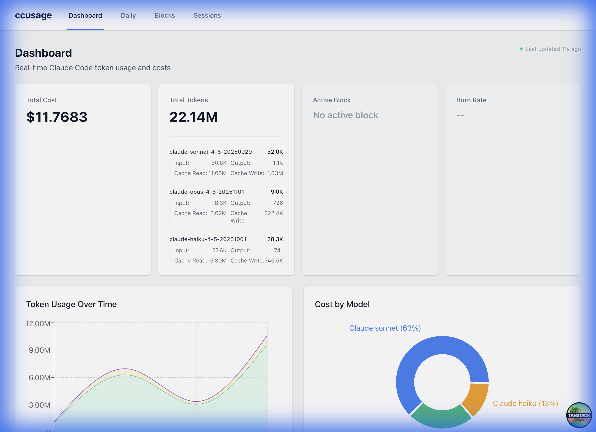

# ccusage-ui

A dashboard for tracking Cursor usage, costs, and tokens.



## Overview

This project provides a visual interface to monitor your Cursor usage statistics, including:

- Total Cost
- Burn Rate
- Token Usage by Model
- Session estimations

## Getting Started

To run this application:

```bash
npm install
npm run dev
```

## Building For Production

To build this application for production:

```bash
npm run build
```

## Contributing

This project is open source and open for contribution! We welcome pull requests and issues. Feel free to fork the repository and submit changes.

## Tech Stack

- [TanStack Start](https://tanstack.com/start)
- [TanStack Query](https://tanstack.com/query)
- [Tailwind CSS](https://tailwindcss.com)
- [Vite](https://vitejs.dev)
